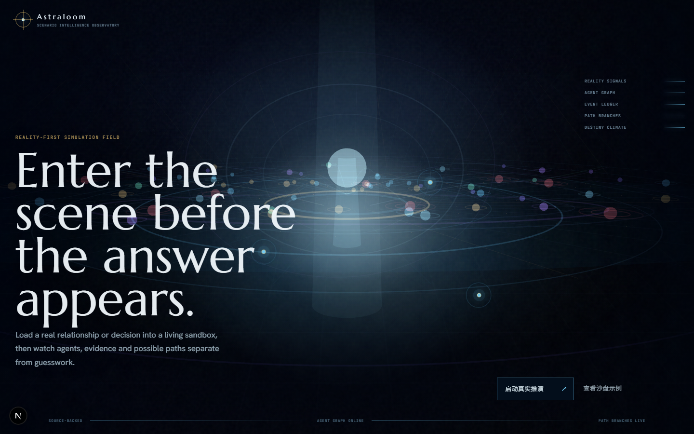
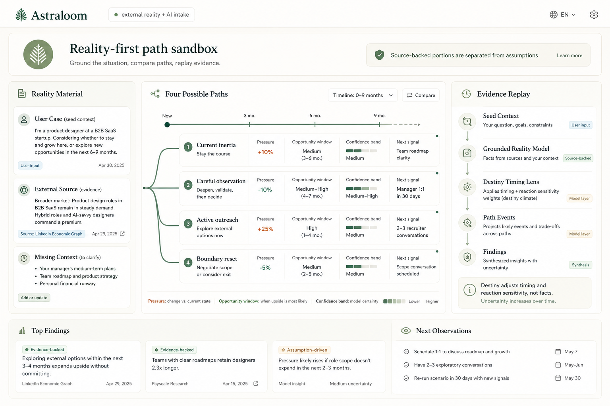

# Astraloom

> 将复杂的现实处境转化为可追溯、可复盘的多角色情景模拟，而不是给出不可解释的“命运答案”。



<p align="center"><sub>真实运行界面 · 现实信号、多智能体关系与情景分支进入同一观察场</sub></p>

## 项目概览

Astraloom 面向关系、职业、家庭压力等高不确定性决策场景。用户提供现实背景后，系统会整理关键人物和关系，生成可检查的 Agent Profile 与 Relation Graph，再通过事件序列模拟可能的变化路径。每个重要结论都应能回溯到人物、关系、事件和证据。

| 项目维度 | 说明 |
| --- | --- |
| **产品类型** | AI 原生决策观察与情景模拟系统 |
| **核心问题** | 复杂现实信息难以结构化，普通 AI 回答缺少证据和过程 |
| **系统输出** | 人物档案、关系图谱、事件演化、情景结论与证据链 |
| **工程重点** | 多智能体建模、数据隔离、可追溯性、安全降级与真实浏览器验收 |

## 系统如何工作


这条链路刻意把“输入事实”“模型推断”和“未知信息”分开。系统不是直接生成一篇貌似完整的分析，而是先建立可检查的中间层，再允许结论出现。

## 亮点

- **Evidence-first**：报告结论通过 `evidence_event_ids` 关联模拟事件，避免生成脱离证据的长文本。
- **可解释关系图谱**：用节点、关系、压力与支持因素呈现现实处境，并锁定图谱快照作为模拟输入。
- **不确定性表达**：区分事实、推断与未知信息，保留置信度和不确定性说明。
- **安全边界**：高风险场景触发保守处理与能力降级；产品不包装成算命或确定性预测工具。
- **完整产品链路**：包含现实信息采集、澄清、人物与关系、运行过程、结果、历史和反馈闭环。

## 结果层：让结论可以被检查



结果页将不同路径的压力、机会窗口、置信区间和下一观察信号并置，同时保留从现实材料到结论的证据回放。对用户而言，真正有价值的不是一个“答案”，而是知道答案基于什么、哪里仍然未知、下一步应观察什么。

## 关键工程判断

| 判断 | 设计选择 | 原因 |
| --- | --- | --- |
| 模拟输入不可漂移 | 使用已确认的关系图谱快照作为运行输入 | 确保结果能够复现和追踪 |
| 结论不能脱离事件 | 重要 Claim 关联 `evidence_event_ids` | 避免报告成为独立生成的“神秘文章” |
| 历史与当前场景分离 | 当前链路绑定 Seed / Graph，历史按账户聚合 | 防止旧场景数据污染当前判断 |
| 高风险场景先降级 | 安全检查先于生成与解锁 | 在能力层而不是免责声明层控制风险 |

## 技术实现

- Next.js 16、React 19、TypeScript
- Supabase Auth / PostgreSQL / Row Level Security
- React Flow 关系图谱、Three.js / GSAP 交互视觉
- Zod 数据契约与服务端验证
- 面向事件、证据链与安全规则的分层领域模块

## 本地运行

```bash
npm install
cp .env.local.example .env.local
npm run dev
```

访问 `http://localhost:3000`。需要完整登录和持久化流程时，请继续阅读 [Supabase 配置说明](SUPABASE_SETUP.md)。

常用检查：

```bash
npm run lint
npm run type-check
npm run build
```

## 进一步了解

- [产品定位](PRODUCT.md)
- [产品宪法与证据链原则](docs/PRODUCT_CONSTITUTION.md)
- [MVP 范围](docs/MVP_SCOPE.md)
- [架构目标](docs/ARCHITECTURE_TARGET.md)
- [安全规则](docs/SAFETY_RULES.md)

## 项目边界

Astraloom 是一个持续演进的产品工程项目。仓库展示的是“现实信息如何进入可解释模拟系统”的产品与技术探索，不构成心理、法律、医疗、投资或确定性预测建议。
